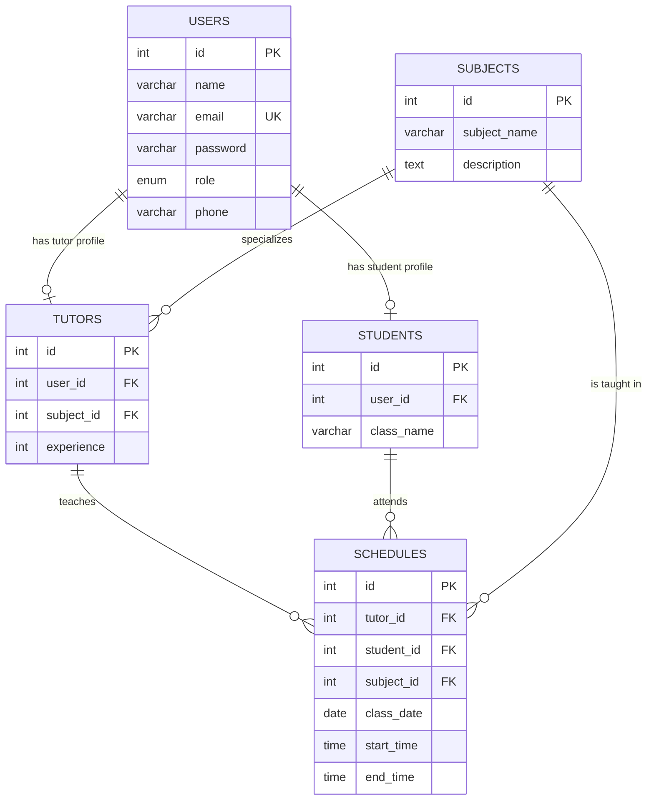

# Tuition Management System DBMS Documentation

## ER Diagram

## Normalization up to 3NF

1. First Normal Form: all columns contain atomic values, and each table has a primary key.
2. Second Normal Form: non-key attributes depend on the full primary key. Each table uses a single-column surrogate primary key, so partial dependency is avoided.
3. Third Normal Form: non-key attributes do not depend on other non-key attributes. User data, subject data, tutor/student profile data, and schedule data are separated.

## Constraints

- Primary keys exist on all tables.
- `users.email` is unique.
- Required fields use `NOT NULL`.
- Foreign keys connect profile and schedule tables.
- Schedule relationships use `ON DELETE CASCADE`.
- Schedule time has a `CHECK (end_time > start_time)` constraint.

## Advanced Features

- `view_schedule_details` joins schedule, tutor, student, and subject data.
- `trg_after_schedule_insert` writes each new schedule to `schedule_audit`.
- `assign_schedule(tutor_id, student_id, subject_id, date)` inserts a one-hour default schedule.
- `assign_schedule_with_time(...)` is used by the UI when start and end time are provided.
- Indexes exist on `schedules.tutor_id`, `schedules.student_id`, `schedules.subject_id`, and `schedules.class_date`.
